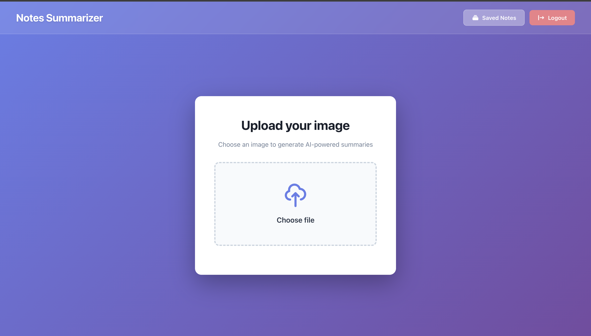
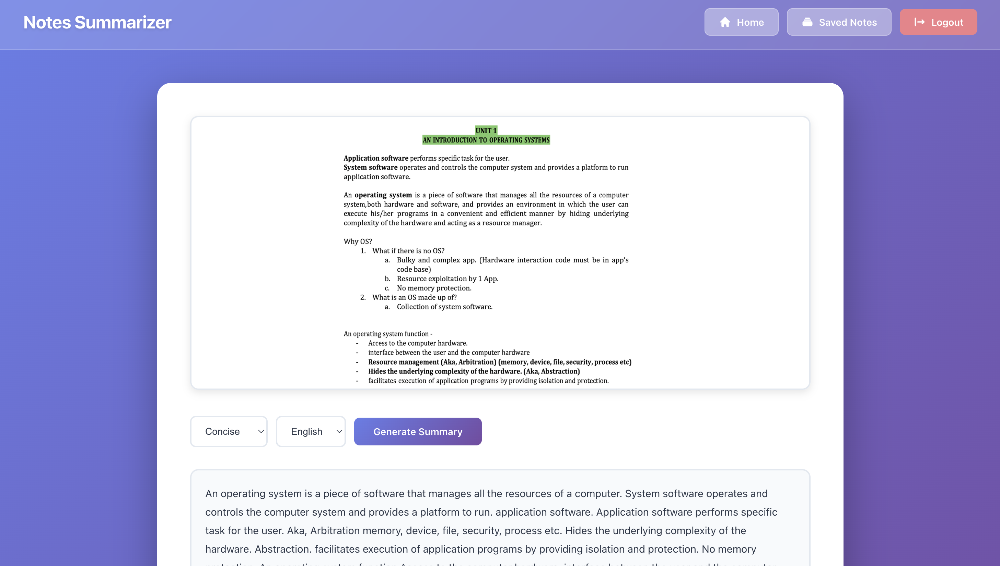
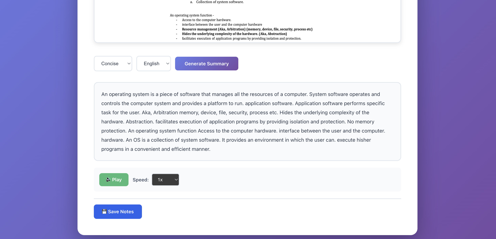
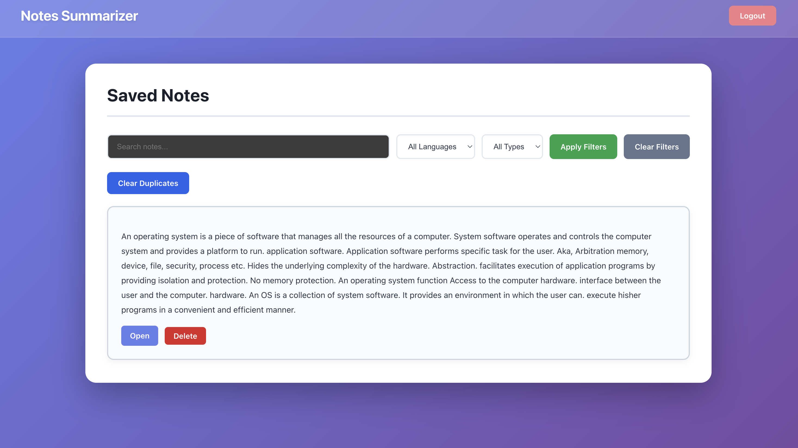

### AI Notes Summarizer

An end-to-end AI-powered Notes Summarization platform that extracts text from images using OCR, summarizes it using LLMs, and optionally translates the output — all deployed with a production-grade microservice architecture.
LiveLink-> https://ai-notes-summarizer-coral.vercel.app

## Features

- Image Upload (notes, scanned pages, PDFs as images)

- OCR using PaddleOCR (via Hugging Face Space)

- AI Summarization (Concise / Standard / Detailed)

- Multi-language Translation

- JWT-based Authentication

- Cloudinary Image Storage

- Save & View Past Summaries

- OCR Caching for Performance

- Pagination

## System Architecture

Frontend (Vercel - React + Vite)
        |
        | REST API
        ↓
Backend (Render - Node.js + Express)
        |
        | Image URL → Multipart Upload
        ↓
OCR Service (Hugging Face Space - FastAPI + PaddleOCR)
        |
        ↓
Extracted Text
        |
        ↓
Hugging Face LLM (Summarization)

## 🛠️ Tech Stack
# Frontend 

React + Vite

Axios / Fetch

Deployed on Vercel

# Backend

Node.js + Express

MongoDB (Mongoose)

JWT Authentication

Cloudinary SDK

Deployed on Render

# OCR Microservice

FastAPI

PaddleOCR

OpenCV

Deployed on Hugging Face Spaces

# AI / NLP

Hugging Face Inference API

Text Summarization

Language Translation

# ⚠️ Python Version Requirement # 
Python 3.10.x is REQUIRED
> PaddleOCR is **not compatible with Python 3.11+**

## 🔑 Environment Variables
# Backend (Render)
MONGO_URI=your_mongodb_uri
JWT_SECRET=your_jwt_secret

CLOUDINARY_CLOUD_NAME=xxxx
CLOUDINARY_API_KEY=xxxx
CLOUDINARY_API_SECRET=xxxx

HUGGINGFACE_API_KEY=hf_xxxx

OCR_SERVICE_URL=https://<your-hf-space>.hf.space/ocr

# Frontend (Vercel)
VITE_API_BASE_URL=https://your-backend.onrender.com

## 📸 Screenshots

### 📤 Upload Image

### 🧠 Generate Summary

### 💾 Saved Notes

## 🧩 Dependencies (Local Setup)
🖥️ Frontend
cd client
npm install

🌐 Backend
cd server
npm install

🔍 OCR Microservice
cd paddle-ocr-service
pip install -r requirements.txt

requirements.txt:
fastapi
uvicorn
paddleocr
paddlepaddle
opencv-python
numpy
python-multipart

## ▶️ Running Locally
1️⃣ Start OCR Service
uvicorn app:app --host 0.0.0.0 --port 8000

2️⃣ Start Backend
npm run dev

3️⃣ Start Frontend
npm run dev

## 📌 Future Improvements

- PDF file support

- Batch image summarization

- User-specific OCR cache

- Streaming summaries

- Dark mode

## 👩‍💻 Author

Ayushi Songara
B.Tech Student(IIITA) | MERN + AI/ML Enthusiast